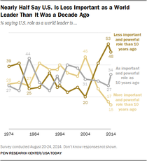

# AdaptiveVision-RL

基于 Qwen3-VL-4B-Instruct 与 GRPO 的单卡自适应视觉获取项目。模型先读取低分辨率全图，并在细节不足时调用局部裁剪工具补充高分辨率视觉信息，在保持视觉问答能力的同时降低视觉 token 消耗。总体范围见 [PLAN.md](PLAN.md)。

项目已完成数据构建、区域标注、GRPO 训练和基准评测。正式数据冻结为 3,000 条 Train、300 条 Val 和 500 条 Test；Train 按原数据 `use_tool` 提示分层，低清即可回答与建议使用高清各 1,500 条。教师模型使用 `glm-5.3-flash`、`reasoning_effort=max` 和像素坐标，在线工具奖励采用 Coverage 与 IoU 的加权几何平均。

训练采用 LoRA 与 GRPO，仅更新低秩适配参数而不进行全参数训练；同时接入两轮裁剪环境、Coverage + IoU 工具奖励、0.01 工具调用成本和 Qwen3-VL 视觉 token 统计。推理阶段最多进行一次局部裁剪；若低分辨率图像已经包含足够信息，模型直接作答。

## 训练配置

| 配置项 | 设置 |
| --- | --- |
| 基座模型 | `Qwen/Qwen3-VL-4B-Instruct` |
| 训练方法 | LoRA + GRPO，单机单卡 |
| LoRA Rank | 64 |
| LoRA Alpha | 128（缩放系数 `alpha / rank = 2`） |
| LoRA 目标模块 | `q_proj`、`k_proj`、`v_proj`、`o_proj`、`gate_proj`、`up_proj`、`down_proj` |
| Train Batch Size | 8 个问题/step |
| 每个问题采样数 | 8 条 rollout，共 64 条轨迹/step |
| PPO Mini Batch Size | 128 条 step-expanded rows，覆盖完整的两轮 rollout batch |
| PPO Micro Batch Size | 4 条 rows/GPU |
| 梯度累积步数 | 32（`128 / 4`） |
| PPO Epochs | 1 |
| Learning Rate | `1.0e-6` |
| Weight Decay | 0.01 |
| LR Warmup | 总训练步数的 3% |
| Clip Ratio | 0.20，下界 0.20、上界 0.24 |
| KL / Entropy | 不使用 KL loss 与 KL reward；entropy coefficient 为 0 |
| 最大 Prompt / Response 长度 | 6,144 / 512 tokens |
| 训练采样 | temperature 1.0、top-p 1.0、每条轨迹最多 2 个交互 step |
| 验证解码 | temperature 0，greedy decoding |
| 训练轮数 | 1 epoch |
| 工具奖励 | Coverage 与 IoU 的几何平均权重均为 0.5，工具调用成本 0.01 |
| 随机种子 | 20260922 |

视觉编码器保持冻结，LoRA 仅注入语言侧注意力与 MLP 投影层；训练启用 gradient checkpointing 和 remove padding，以控制单卡显存占用。每个训练 step 包含 8 个不同问题，每题在线采样 8 条轨迹；轨迹按最多两轮交互展开为 128 条 rows，再以每卡 4 条的 micro batch 完成梯度累积。

## 样本示例

下面随机选取训练集中的 `smart-train-03503`，展示模型从低分辨率全局观察到请求高清局部区域、再生成答案的完整过程。

**问题**

> What does Grey segment represents?

**低分辨率全局图片**



低分辨率全图能够提供图表结构和折线位置，但右侧灰色系列的图例文字较小。模型因此调用局部裁剪工具，请求原始高清图中的图例区域。

**高清局部裁剪图片**


**模型回答**

```xml
<think>
The grey legend is too small to read reliably in the low-resolution overview. I should inspect the legend area in the original high-resolution image.
</think>
<tool_call>
{"name":"request_local_region","arguments":{"bbox_2d":[280,180,420,265]}}
</tool_call>
<think>
The high-resolution crop shows that the grey legend is labeled "As important and powerful role as 10 years ago."
</think>
<answer>
As important and powerful role as 10 years ago.
</answer>
```

## 训练改进

标准 GRPO 将同一个序列级奖励和优势广播到整条回答，难以区分“是否调用工具、裁剪哪里”和“最终答案是否正确”这两类动作；同时，一轮直接回答与两轮工具调用的 token 数不同，统一按整条序列归一化会削弱工具决策的梯度。本项目针对自适应视觉获取任务，在数据与优化两个层面形成了以下四项关键设计。

### 1. 使用 GLM-5.3-Flash 构造裁剪监督数据

工具奖励需要一个能够表示“哪里包含答题证据”的参考区域。为此，本项目先从 VisionThink Smart-Train 中冻结 3,000 条训练样本，并按原始 `use_tool` 标签分层采样：低分辨率即可回答与建议查看高清细节各 1,500 条。数据构造阶段使用 `glm-5.3-flash` 作为区域标注教师，开启 thinking、设置 `reasoning_effort=max`、temperature 0，并让模型查看原始高清图、原图尺寸和问题。标准答案不会放入教师提示词，以避免教师直接根据答案反推区域。

教师必须返回固定 JSON 结构：

```json
{
  "status": "localized",
  "reference_boxes": [[x1, y1, x2, y2]],
  "answer_from_image": "short answer"
}
```

`status` 只能为 `localized`、`global` 或 `uncertain`。对于 `localized`，教师只能返回一个基于原图左上角、右下边界排他的整数像素框；对于无需局部细节的全局问题或无法可靠定位的样本，不生成参考框。设原图宽高为 $W,H$，像素框 $b_{\text{px}}=[x_1,y_1,x_2,y_2]$ 会被确定性转换为奖励计算使用的归一化框：
$$
b_{\text{norm}}=
\left[\frac{x_1}{W},\frac{y_1}{H},\frac{x_2}{W},\frac{y_2}{H}\right].
$$

自动质量控制依次检查 JSON 字段、状态枚举、整数坐标、正面积和图像边界，并将 `answer_from_image` 与数据集答案进行规范化精确匹配或数值精确匹配。只有答案匹配且状态为 `localized` 的样本才标记为 `region_reward_eligible`，进入工具优势统计；`global`、`uncertain` 或答案未通过自动匹配的记录仍可用于结果奖励，但不会以伪零值污染工具奖励分布。

最终 Train 保持 3,000 条有效标注，其中 `localized` 2,929 条、`global` 63 条、`uncertain` 8 条。首轮发现的 46 条无效记录已在保持 24/22 分层比例的前提下确定性替换，详见[训练集替换记录](reports/train_replacement_20260923/RESULTS.md)；[全量可编辑框页面](reports/train3000_glm53_max_full_review/index.html)用于人工复核。

### 2. 基于 Coverage + IoU 的工具奖励

本项目不使用额外奖励模型判断裁剪是否正确，而是直接利用训练集中的参考区域计算几何奖励。设模型实际执行的裁剪框为 $p$，参考框为 $g$，二者交集面积为 $I(p,g)$，则：

$$
I(p,g)=\mathrm{area}(p\cap g),
$$

$$
\mathrm{Coverage}(p,g)=\frac{I(p,g)}{\mathrm{area}(g)},
\qquad
\mathrm{IoU}(p,g)=\frac{I(p,g)}{\mathrm{area}(p)+\mathrm{area}(g)-I(p,g)}.
$$

Coverage 保证参考证据尽量完整地落在裁剪区域内，IoU 则抑制过大的裁剪框。最终工具奖励采用二者的加权几何平均：

$$
R_{\text{tool}}(p)=\max_{g\in\mathcal{G}}
\mathrm{Coverage}(p,g)^{w}
\mathrm{IoU}(p,g)^{1-w},
\qquad w=0.5.
$$

因此当前配置等价于 $R_{\text{tool}}=\max_{g\in\mathcal{G}}\sqrt{\mathrm{Coverage}\cdot\mathrm{IoU}}$。若一个样本有多个可接受参考框，取奖励最高者；没有参考框的轨迹不参与工具优势的统计，而不是按零奖励处理。

最终答案对应的结果奖励为：

$$
R_{\text{out}}^{(i)}=R_{\text{acc}}^{(i)}+R_{\text{fmt}}^{(i)}+R_{\text{bal}}^{(i)}.
$$

其中正确性奖励 $R_{\text{acc}}\in\{0,1\}$，格式奖励最高为 0.5。为避免模型无条件调用工具，对答对且调用工具的轨迹施加 $c=0.01$ 的成本；若同组中直接答对的比例低于阈值 $\theta=0.2$，答对但直接作答的轨迹也施加相同成本，以减少偶然猜对带来的错误策略信号。

### 3. 工具决策与答案生成使用分离优势

对同一问题采样得到的轨迹组 $\mathcal{B}$，结果优势在全组内标准化：

$$
A_{\text{out}}^{(i)}=
\frac{R_{\text{out}}^{(i)}-\mu(R_{\text{out}}\mid\mathcal{B})}
{\sigma(R_{\text{out}}\mid\mathcal{B})+\varepsilon}.
$$

工具优势只在确实调用工具且具有参考框的有效子集 $\mathcal{B}_{\text{tool}}$ 内标准化：

$$
A_{\text{tool}}^{(i)}=
\frac{R_{\text{tool}}^{(i)}-\mu(R_{\text{tool}}\mid\mathcal{B}_{\text{tool}})}
{\sigma(R_{\text{tool}}\mid\mathcal{B}_{\text{tool}})+\varepsilon},
\qquad \varepsilon=10^{-6}.
$$

直接回答和无参考框轨迹的工具优势固定为 0。对 token 分配优势时，答案轮只学习最终回答质量，工具轮同时学习最终结果与裁剪质量：

$$
A_{i,t}=\begin{cases}
A_{\text{out}}^{(i)}+\lambda A_{\text{tool}}^{(i)}, & t\in\mathcal{T}_{\text{tool}},\\
A_{\text{out}}^{(i)}, & t\in\mathcal{T}_{\text{answer}},
\end{cases}
\qquad \lambda=0.3.
$$

这样，裁剪框正确但最终回答错误、或最终回答正确但裁剪范围不合理时，不会再让两类 token 接收完全相同的学习信号。

### 4. 工具轮与答案轮独立归一化 Loss

令 $\rho_{i,t}=\pi_{\theta}(o_{i,t})/\pi_{\text{old}}(o_{i,t})$。本项目使用非对称 PPO clipping，下界 $\epsilon_{\text{low}}=0.20$、上界 $\epsilon_{\text{high}}=0.24$。单 token 的 clipped loss 为：

$$
\ell_{i,t}^{\text{clip}}=
\max\left(
-\rho_{i,t}A_{i,t},
-\mathrm{clip}(\rho_{i,t},1-\epsilon_{\text{low}},1+\epsilon_{\text{high}})A_{i,t}
\right).
$$

对负优势进一步使用 $c_{\text{dual}}=3.0$ 的 dual clipping：

$$
\ell_{i,t}=\begin{cases}
\min(-c_{\text{dual}}A_{i,t},\ell_{i,t}^{\text{clip}}), & A_{i,t}<0,\\
\ell_{i,t}^{\text{clip}}, & A_{i,t}\ge 0.
\end{cases}
$$

设完整 mini batch 中工具轮和答案轮的有效 token 数分别为 $N_{\text{tool}}$ 与 $N_{\text{answer}}$，策略损失不再除以整条序列的总 token 数，而是分别归一化后相加：

$$
\mathcal{L}_{\text{policy}}=
\frac{1}{N_{\text{tool}}}\sum_{(i,t)\in\mathcal{T}_{\text{tool}}}\ell_{i,t}
+\frac{1}{N_{\text{answer}}}\sum_{(i,t)\in\mathcal{T}_{\text{answer}}}\ell_{i,t}.
$$

实现时会在完整 PPO mini batch 上统计两个分母，并通过带权 loss mask 跨 micro batch 和梯度累积精确还原上述公式；为 batch 对齐而复制的 padding rows 权重恒为 0。该设计避免工具轮因 token 较少或两轮轨迹较长而被低估，使“是否取图”和“如何作答”获得更均衡的优化强度。

## 实验结果

在相同的 Qwen3-VL-4B-Instruct 初始化、训练数据、GRPO 超参数和解码设置下，对比以下两种视觉输入策略：

- **Base 高清图 + GRPO**：始终输入完整高清图，作为 100% 视觉 token 基线。
- **低分辨率 + 局部裁剪 + GRPO**：先输入 1/4 分辨率全图，模型仅在需要细节时从原始高清图中裁剪一个局部区域。

| 方法 | ChartQA（test） | OCRBench（test） | DocVQA（val） | MME（test） | MMVet（test） | RealWorldQA（test） | POPE（test） | MathVista（testmini） | MathVerse（testmini） | 视觉 token ↓ | 相对平均性能 ↑ |
| --- | ---: | ---: | ---: | ---: | ---: | ---: | ---: | ---: | ---: | ---: | ---: |
| Base 高清图 + GRPO | 81.3 | 80.1 | 92.6 | 2270 | 60.6 | 68.7 | 85.6 | 72.8 | 61.9 | 100% | 100.0% |
| **低分辨率 + 局部裁剪 + GRPO** | **74.8** | **74.2** | **90.4** | **2294** | **60.0** | **65.4** | **85.6** | **68.4** | **58.8** | **57%** | **96.3%** |

其中 OCRBench 按满分 100 归一化，MME 报告总分；“相对平均性能”先分别计算各基准相对 Base 的得分比例，再取宏平均，避免 MME 的量纲主导平均值。

低分辨率全图配合一次自适应局部裁剪将平均视觉 token 消耗从 100% 降至 57%，减少 **43%**；九项基准的宏平均相对性能保持在 **96.3%**。细粒度文字、图表和视觉数学任务对分辨率更敏感，因此 ChartQA、OCRBench 与 MathVista 有一定下降；DocVQA、MMVet 和 POPE 基本保持，高效方案在 MME 上略有提升。整体上，该策略以约 3.7% 的相对平均性能差换取 43% 的视觉 token 节省。
