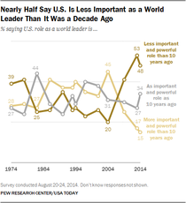

# AdaptiveVision-RL

本项目基于 Qwen3-VL-4B-Thinking 探索自适应视觉获取。两轮方案先读取低分辨率全图，需要细节时再调用局部裁剪工具读取高清区域；对照方案只读取一次高清全图。两者都经过 GRPO 训练，其中两轮方案采用本项目的分离优势与分轮损失归一化改进。总体范围见 [PLAN.md](PLAN.md)。

项目已完成数据构建、区域标注、GRPO 训练和基准评测。正式数据冻结为 3,000 条 Train、300 条 Val 和 500 条 Test；Train 按原数据 `use_tool` 提示分层，低清即可回答与建议使用高清各 1,500 条。教师模型使用 `glm-5.3-flash`、`reasoning_effort=max` 和像素坐标，在线工具奖励采用 Coverage 与 IoU 的加权几何平均。

以下训练方法与配置针对两轮方案：使用 LoRA 更新低秩适配参数，接入两轮裁剪环境、Coverage + IoU 工具奖励、0.01 工具调用成本和 Qwen3-VL 视觉 token 统计。推理阶段最多进行一次局部裁剪；若低分辨率图像已经包含足够信息，模型直接作答。最新的五项基准结果见[实验结果](#实验结果)。

## 两轮方案训练配置

| 配置项 | 设置 |
| --- | --- |
| 基座模型 | Qwen3-VL-4B-Thinking 经 SFT 合并后的权重 |
| 训练方法 | LoRA + 改进的两轮 GRPO，单机单卡 |
| LoRA Rank | 64 |
| LoRA Alpha | 128（缩放系数 `alpha / rank = 2`） |
| LoRA 目标模块 | `q_proj`、`k_proj`、`v_proj`、`o_proj`、`gate_proj`、`up_proj`、`down_proj` |
| Train Batch Size | 8 个问题/step |
| 每个问题采样数 | 8 条 rollout，共 64 条轨迹/step |
| PPO Mini Batch Size | 128 条 step-expanded rows，覆盖完整的两轮 rollout batch |
| PPO Micro Batch Size | 2 条 rows/GPU |
| 旧策略 log-prob Micro Batch Size | 4 条 rows/GPU |
| 梯度累积步数 | 64（`128 / 2`） |
| PPO Epochs | 1 |
| Learning Rate | `1.0e-6` |
| Weight Decay | 0.01 |
| LR Warmup | 总训练步数的 3% |
| Clip Ratio | 0.20，下界 0.20、上界 0.24 |
| KL / Entropy | 不使用 KL loss 与 KL reward；entropy coefficient 为 0 |
| 最大 Prompt / Response 长度 | 6,144 / 1,024 tokens |
| 训练采样 | temperature 1.0、top-p 1.0、每条轨迹最多 2 个交互 step |
| 验证解码 | temperature 0，greedy decoding |
| 训练轮数 | 1 epoch |
| 工具奖励 | Coverage 与 IoU 的几何平均权重均为 0.5，工具调用成本 0.01 |
| 随机种子 | 20260922 |

视觉编码器保持冻结，LoRA 仅注入语言侧注意力与 MLP 投影层；训练启用 gradient checkpointing 和 remove padding，以控制单卡显存占用。每个训练 step 包含 8 个不同问题，每题在线采样 8 条轨迹；轨迹按最多两轮交互展开为 128 条 rows，再以每卡 2 条的 micro batch 完成梯度累积。

## 样本示例

下面随机选取训练集中的 `smart-train-03503`，展示模型从低分辨率全局观察到请求高清局部区域、再生成答案的完整过程。

**问题**

> What does Grey segment represents?

**低分辨率全局图片**



低分辨率全图能够提供图表结构和折线位置，但右侧灰色系列的图例文字较小。模型因此调用局部裁剪工具，请求原始高清图中的图例区域。

**高清局部裁剪图片**


**模型回答**

```xml
<think>
The grey legend is too small to read reliably in the low-resolution overview. I should inspect the legend area in the original high-resolution image.
</think>
<tool_call>
{"name":"request_local_region","arguments":{"bbox_2d":[280,180,420,265]}}
</tool_call>
<think>
The high-resolution crop shows that the grey legend is labeled "As important and powerful role as 10 years ago."
</think>
<answer>
As important and powerful role as 10 years ago.
</answer>
```

## 训练改进

标准 GRPO 将同一个序列级奖励和优势广播到整条回答，难以区分“是否调用工具、裁剪哪里”和“最终答案是否正确”这两类动作；同时，一轮直接回答与两轮工具调用的 token 数不同，统一按整条序列归一化会削弱工具决策的梯度。本项目针对自适应视觉获取任务，在数据与优化两个层面形成了以下四项关键设计。

### 1. 使用 GLM-5.3-Flash 构造裁剪监督数据

工具奖励需要一个能够表示“哪里包含答题证据”的参考区域。为此，本项目先从 VisionThink Smart-Train 中冻结 3,000 条训练样本，并按原始 `use_tool` 标签分层采样：低分辨率即可回答与建议查看高清细节各 1,500 条。数据构造阶段使用 `glm-5.3-flash` 作为区域标注教师，开启 thinking、设置 `reasoning_effort=max`、temperature 0，并让模型查看原始高清图、原图尺寸和问题。标准答案不会放入教师提示词，以避免教师直接根据答案反推区域。

教师必须返回固定 JSON 结构：

```json
{
  "status": "localized",
  "reference_boxes": [[x1, y1, x2, y2]],
  "answer_from_image": "short answer"
}
```

`status` 只能为 `localized`、`global` 或 `uncertain`。对于 `localized`，教师只能返回一个基于原图左上角、右下边界排他的整数像素框；对于无需局部细节的全局问题或无法可靠定位的样本，不生成参考框。设原图宽高为 $W,H$，像素框 $b_{\text{px}}=[x_1,y_1,x_2,y_2]$ 会被确定性转换为奖励计算使用的归一化框：
$$
b_{\text{norm}}=
\left[\frac{x_1}{W},\frac{y_1}{H},\frac{x_2}{W},\frac{y_2}{H}\right].
$$

自动质量控制依次检查 JSON 字段、状态枚举、整数坐标、正面积和图像边界，并将 `answer_from_image` 与数据集答案进行规范化精确匹配或数值精确匹配。只有答案匹配且状态为 `localized` 的样本才标记为 `region_reward_eligible`，进入工具优势统计；`global`、`uncertain` 或答案未通过自动匹配的记录仍可用于结果奖励，但不会以伪零值污染工具奖励分布。

最终 Train 保持 3,000 条有效标注，其中 `localized` 2,929 条、`global` 63 条、`uncertain` 8 条。首轮发现的 46 条无效记录已在保持 24/22 分层比例的前提下确定性替换，详见[训练集替换记录](reports/train_replacement_20260923/RESULTS.md)；[全量可编辑框页面](reports/train3000_glm53_max_full_review/index.html)用于人工复核。

### 2. 基于 Coverage + IoU 的工具奖励

本项目不使用额外奖励模型判断裁剪是否正确，而是直接利用训练集中的参考区域计算几何奖励。设模型实际执行的裁剪框为 $p$，参考框为 $g$，二者交集面积为 $I(p,g)$，则：

$$
I(p,g)=\mathrm{area}(p\cap g),
$$

$$
\mathrm{Coverage}(p,g)=\frac{I(p,g)}{\mathrm{area}(g)},
\qquad
\mathrm{IoU}(p,g)=\frac{I(p,g)}{\mathrm{area}(p)+\mathrm{area}(g)-I(p,g)}.
$$

Coverage 保证参考证据尽量完整地落在裁剪区域内，IoU 则抑制过大的裁剪框。最终工具奖励采用二者的加权几何平均：

$$
R_{\text{tool}}(p)=\max_{g\in\mathcal{G}}
\mathrm{Coverage}(p,g)^{w}
\mathrm{IoU}(p,g)^{1-w},
\qquad w=0.5.
$$

因此当前配置等价于 $R_{\text{tool}}=\max_{g\in\mathcal{G}}\sqrt{\mathrm{Coverage}\cdot\mathrm{IoU}}$。若一个样本有多个可接受参考框，取奖励最高者；没有参考框的轨迹不参与工具优势的统计，而不是按零奖励处理。

最终答案对应的结果奖励为：

$$
R_{\text{out}}^{(i)}=R_{\text{ans}}^{(i)}+R_{\text{fmt}}^{(i)}+R_{\text{bal}}^{(i)}.
$$

只有协议合法的最终答案参与答案评分，格式不合规时答案分和准确率均为 0。规范化文本或纯数字数值精确匹配得 1；两个同号非零纯数字不相等时，原始相似度 $S=\max(0,1-|p-g|/\max(|p|,|g|))$，多个标准答案取最高分，并将非精确匹配的 $S$ 上限设为 0.9999。非数值答案、带单位答案以及异号或零与非零的比较不获部分分。日志中的 `answer_score` 保留这个原始相似度；训练的非精确答案奖励为 $R_{\text{ans}}=(1-c)S$，为成本预留空间，确保格式相同时，精确答案扣除成本后仍优于近似错误答案。例如 `42130` 对 `42138` 的原始答案分约为 0.99981，训练答案奖励约为 0.98981。准确率仍只统计精确匹配。格式奖励最高为 0.1。为避免模型无条件调用工具，对精确答对且调用工具的轨迹施加 $c=0.01$ 的成本；若同组中直接精确答对的比例低于阈值 $\theta=0.2$，精确答对但直接作答的轨迹也施加相同成本，以减少偶然猜对带来的错误策略信号。

### 3. 工具决策与答案生成使用分离优势

对同一问题采样得到的轨迹组 $\mathcal{B}$，结果优势在全组内标准化：

$$
A_{\text{out}}^{(i)}=
\frac{R_{\text{out}}^{(i)}-\mu(R_{\text{out}}\mid\mathcal{B})}
{\sigma(R_{\text{out}}\mid\mathcal{B})+\varepsilon}.
$$

工具优势只在确实调用工具且具有参考框的有效子集 $\mathcal{B}_{\text{tool}}$ 内标准化：

$$
A_{\text{tool}}^{(i)}=
\frac{R_{\text{tool}}^{(i)}-\mu(R_{\text{tool}}\mid\mathcal{B}_{\text{tool}})}
{\sigma(R_{\text{tool}}\mid\mathcal{B}_{\text{tool}})+\varepsilon},
\qquad \varepsilon=10^{-6}.
$$

直接回答和无参考框轨迹的工具优势固定为 0。对 token 分配优势时，答案轮只学习最终回答质量，工具轮同时学习最终结果与裁剪质量：

$$
A_{i,t}=\begin{cases}
A_{\text{out}}^{(i)}+\lambda A_{\text{tool}}^{(i)}, & t\in\mathcal{T}_{\text{tool}},\\
A_{\text{out}}^{(i)}, & t\in\mathcal{T}_{\text{answer}},
\end{cases}
\qquad \lambda=0.3.
$$

这样，裁剪框正确但最终回答错误、或最终回答正确但裁剪范围不合理时，不会再让两类 token 接收完全相同的学习信号。

### 4. 工具轮与答案轮独立归一化 Loss

令 $\rho_{i,t}=\pi_{\theta}(o_{i,t})/\pi_{\text{old}}(o_{i,t})$。本项目使用非对称 PPO clipping，下界 $\epsilon_{\text{low}}=0.20$、上界 $\epsilon_{\text{high}}=0.24$。单 token 的 clipped loss 为：

$$
\ell_{i,t}^{\text{clip}}=
\max\left(
-\rho_{i,t}A_{i,t},
-\mathrm{clip}(\rho_{i,t},1-\epsilon_{\text{low}},1+\epsilon_{\text{high}})A_{i,t}
\right).
$$

对负优势进一步使用 $c_{\text{dual}}=3.0$ 的 dual clipping：

$$
\ell_{i,t}=\begin{cases}
\min(-c_{\text{dual}}A_{i,t},\ell_{i,t}^{\text{clip}}), & A_{i,t}<0,\\
\ell_{i,t}^{\text{clip}}, & A_{i,t}\ge 0.
\end{cases}
$$

设完整 mini batch 中工具轮和答案轮的有效 token 数分别为 $N_{\text{tool}}$ 与 $N_{\text{answer}}$，策略损失不再除以整条序列的总 token 数，而是分别归一化后相加：

$$
\mathcal{L}_{\text{policy}}=
\frac{1}{N_{\text{tool}}}\sum_{(i,t)\in\mathcal{T}_{\text{tool}}}\ell_{i,t}
+\frac{1}{N_{\text{answer}}}\sum_{(i,t)\in\mathcal{T}_{\text{answer}}}\ell_{i,t}.
$$

实现时会在完整 PPO mini batch 上统计两个分母，并通过带权 loss mask 跨 micro batch 和梯度累积精确还原上述公式；为 batch 对齐而复制的 padding rows 权重恒为 0。该设计避免工具轮因 token 较少或两轮轨迹较长而被低估，使“是否取图”和“如何作答”获得更均衡的优化强度。

## 实验结果

### 评测设置

两份结果使用相同的冻结评测集 `eval_6bench_3000_v1`；本节仅展示 ChartQA、OCRBench、MME、RealWorldQA、POPE 五项，每项 500 题，共 2,500 题。两个 `summary.json` 的 `selection_sha256` 相同，均为 `e3743839…320326a1`，且 `partial=false`。推理均使用 temperature 0、batch size 8 和最多 1,024 个回答 token。评测集抽样和本地判分规则见[基准数据](docs/BENCHMARK_DATA.md)与[评测说明](docs/BENCHMARK_EVALUATION.md)。这里的 MME 是所选 500 题的本地准确率，不是 MME 官方总分。

- **单轮高清 GRPO**：输入高清全图，只生成一轮答案。该模型由原始 Qwen3-VL-4B-Thinking 权重和单轮 GRPO LoRA 适配器组成。
- **改进的两轮 GRPO**：输入低清全图，可直接回答，也可请求一次高清局部裁剪后在第二轮回答。该模型由 Qwen3-VL-4B-Thinking 的 SFT 合并权重和改进的两轮 GRPO 第 300 步 LoRA 适配器组成。

两条训练路线的起始权重和训练阶段不同，因此下表展示的是**最终模型与推理策略的整体对照**，不能单独解释为分轮优化方法的消融实验。

### 主结果：准确率与视觉 token 比值

表中五项数据集均报告本地准确率（%）；平均准确率根据这五项的 2,500 题重新计算。视觉 token 比值以每题「单次高清全图」的 token 数为分母，先逐题计算，再对所示五项取平均。主表使用**实际处理比值**：两轮方案将首轮低清图、第二轮重复输入的低清图以及局部高清图全部计入；单轮高清方案按定义为 100%。

| 方法 | ChartQA | OCRBench | MME | RealWorldQA | POPE | 平均准确率 ↑ | 视觉 token 比值 ↓ |
| --- | ---: | ---: | ---: | ---: | ---: | ---: | ---: |
| 单轮高清 GRPO | **69.5** | **78.0** | **55.3** | **64.8** | **86.2** | **70.76** | 100.00% |
| 改进的两轮 GRPO | 65.8 | 74.6 | 49.8 | 60.4 | 84.0 | 66.92 | **56.11%** |

在所示五项中，两轮方案正确回答 1,673/2,500 题，单轮高清方案正确回答 1,769/2,500 题；平均准确率相差 **3.84 个百分点**。两轮方案的实际处理视觉 token 比值为 **56.11%**，比单轮高清方案低 **43.89 个百分点**。各数据集的实际处理比值如下：

| 数据集 | 改进的两轮 GRPO：视觉 token 比值 ↓ |
| --- | ---: |
| ChartQA | 68.94% |
| OCRBench | 84.35% |
| MME | 52.51% |
| RealWorldQA | 27.04% |
| POPE | 29.69% |

### 耗时与结果分析

两份摘要只记录了**完整 3,000 题运行**的评测总耗时，包含生成与评测流程；没有提供分数据集耗时，因此下表不能视为上面五项 2,500 题的单独耗时。

| 方法 | 3,000 题评测总耗时 ↓ |
| --- | ---: |
| 单轮高清 GRPO | 5,103.27 秒（85 分 03 秒） |
| 改进的两轮 GRPO | **1,370.13 秒（22 分 50 秒）** |

在这两次完整运行记录中，两轮方案耗时为单轮高清方案的 **26.86%**。所示五项中，OCRBench 的实际处理视觉 token 比值最高（84.35%），RealWorldQA 和 POPE 较低（27.04% 和 29.69%）。五项准确率均低于单轮高清方案。
